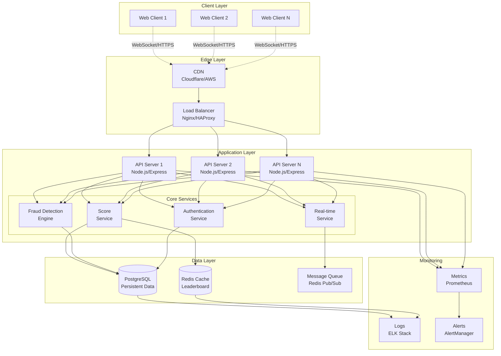
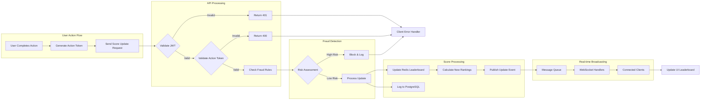
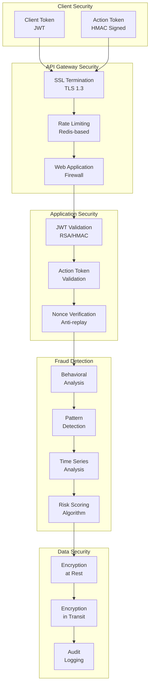
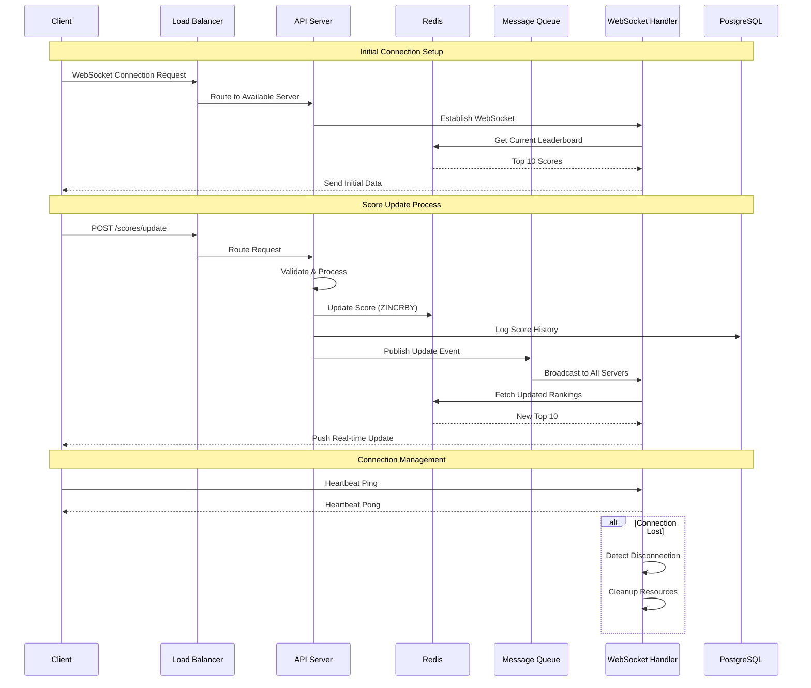
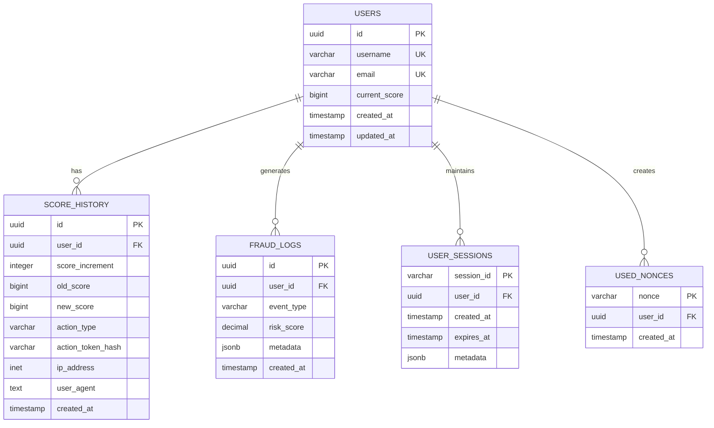
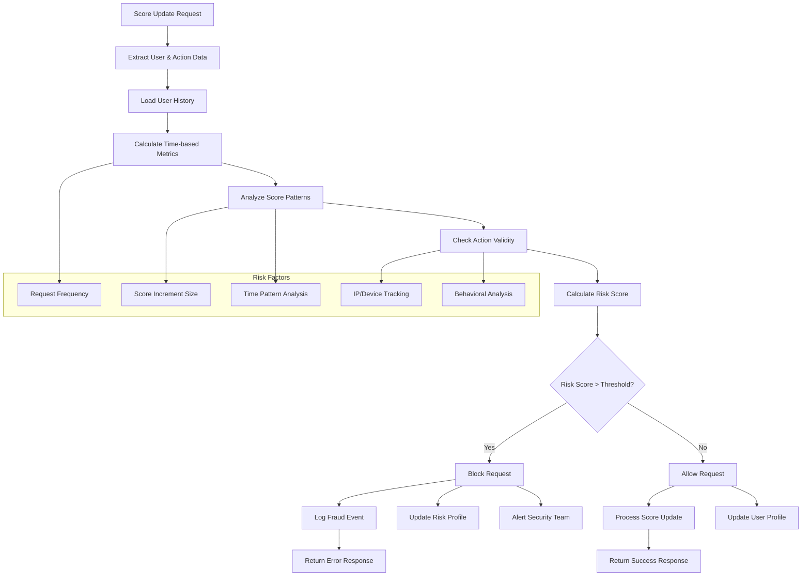
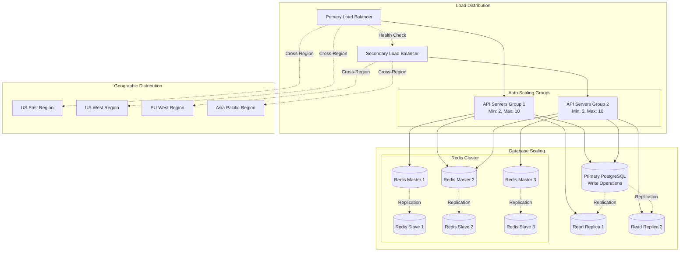

# System Architecture Diagrams

## High-Level System Architecture

## Data Flow Architecture

## Security Architecture

## Real-time Communication Flow

## Database Schema Relationships

## Fraud Detection Algorithm Flow

## Scaling Strategy

